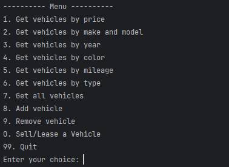
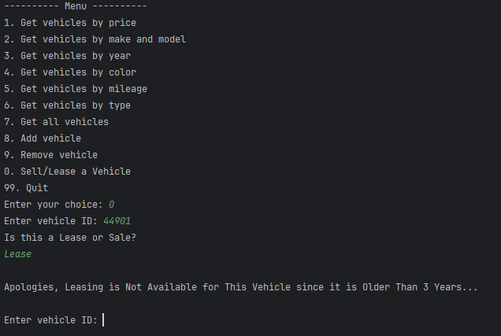
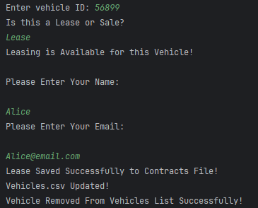
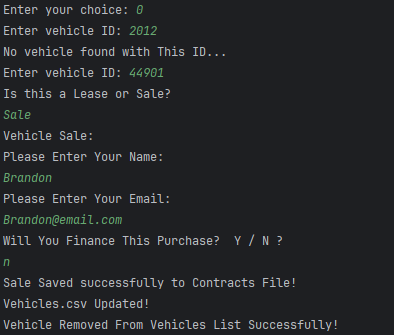

# Object-Oriented Car Dealership Part 2 - Brandon Morse

## The Car Dealership is a store inventory application for vehicles that allows the user to view, add and remove vehicles from their dealership for customers to eventually buy. Specifically for this iteration of the application, methods for creating a Lease and Sale Contract, adding them to a contract csv file and removing them from the vehicle csv file afterward have been added.

## User Stories

- As a user I want to ask the customer if they want to add a sale or lease of a vehicle so that I can log the information accordingly

- As a user, I want the application to calculate the pricing of the sale or lease I add so that I don't have to calculate it myself

- As a user, I want vehicles a customer wants to buy or lease to get removed from the Vehicle list so that information is always up to date

- As a user, I want the calculations to differ depending on whether a lease or sale is being processed so that I can speed up the vehicle to contract process

## Setup

1. Create the UserInterface, DealershipFileManager, Dealership, Vehicle and Program classes
2. Create the constructor, getters and setters inside the Vehicle class for all vehicle attributes
3. Create the getVehiclesBy methods that write the logic for display filtering
4. Create a buffered reader and buffered writer inside the DealershipFileManager class
5. Create methods inside the UserInterface class that will prompt the user to enter the fields they want to filter by
6. Instantiate the UserInterface class inside the Program class and call the display method that holds the application
7. Create the Contract abstract class with the SalesContract and LeaseContract child classes
8. Create the ContractFileManager class that uses instanceof to check whether the user wants to add a Lease or Sale to the Contract File
9. Update the UserInterface class to include the addLeaseOrSale option

### Prerequisites

- IntelliJ IDEA: Ensure you have IntelliJ IDEA installed, which you can download from [here](https://www.jetbrains.com/idea/download/).
- Java SDK: Make sure Java SDK is installed and configured in IntelliJ.

### Running the Application in IntelliJ

Follow these steps to get your Online Store Application running within IntelliJ IDEA:

1. Open IntelliJ IDEA.
2. Select "Open" and navigate to the directory where you cloned or downloaded the project.
3. After the project opens, wait for IntelliJ to index the files and set up the project.
4. Find the main class with the `public static void main(String[] args)` method.
5. Right-click on the file and select 'Run 'YourMainClassName.main()'' to start the application.

## Technologies Used

- IntelliJ (Amazon Corretto 17.0.14)

## Demo

## Future Work

- Security features to be implemented soon!

## Resources

- [W3 Schools for Documentation ](https://www.w3schools.com/java/ref_string_format.asp)
- [Potato Sensei ] (https://chatgpt.com/g/g-681d378b0c90819197b16e49abe384ec-potato-sensei)

## Team Members

- **Brandon Morse** - Application Development

## Interesting Code

The Sales and Lease contracts will differ with input using instanceof and determine what is outputted based on the "lease" or "sale" option.

## Thanks!

- Thank you to Mr. Raymond for continuous support and guidance (Along with Potato Sensei)!
